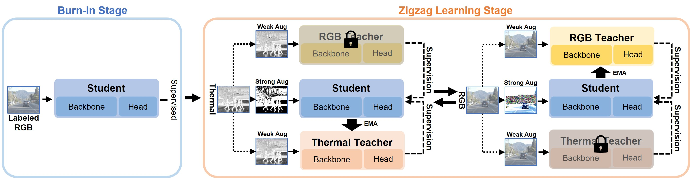

# D3T: Distinctive Dual-Domain Teacher Zigzagging Across RGB-Thermal Gap for Domain-Adaptive Object Detection

 

**D3T: Distinctive Dual-Domain Teacher Zigzagging Across RGB-Thermal Gap for Domain-Adaptive Object Detection** 
[Dinh Phat Do](https://github.com/EdwardDo69), [Taehoon Kim](https://scholar.google.com/citations?user=RrKoTX4AAAAJ&hl=en), [Jaemin Na](https://github.com/NaJaeMin92), Jiwon Kim, Keonho Lee, Kyunghwan Cho, [Wonjun Hwang](https://scholar.google.co.uk/citations?user=-I8AfBAAAAAJ&hl=en) 
### [The IEE/CVF Conference on Computer Vision and Pattern Recognition (CVPR), 2024](https://cvpr.thecvf.com/) 

## We will release the code on Monday, June 17, 2024, coinciding with the commencement of the CVPR2024 conference. We look forward to seeing you at the Seattle Convention Center, Seattle, WA, USA.

For inquiries, please contact: phatai@ajou.ac.kr
